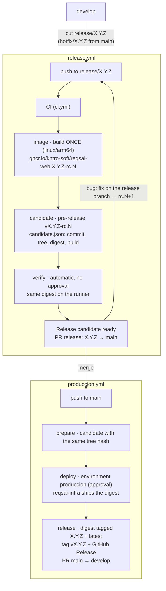

# Contributing Guide — Kntro-Soft / reqsai-web

Thanks for contributing to the **Reqs-AI** frontend. This guide describes the workflow the team
follows to keep the repository organized, the history clean, and the build green.

## Table of Contents

- [Prerequisites](#prerequisites)
- [Local Setup](#local-setup)
- [Build, Run and Test](#build-run-and-test)
- [Project Structure](#project-structure)
- [Branch Structure](#branch-structure)
- [Commit Convention](#commit-convention)
- [Workflow](#workflow)
- [Pull Requests](#pull-requests)
- [Releases and Deployment](#releases-and-deployment)
- [Updating the CHANGELOG](#updating-the-changelog)

---

## Prerequisites

- **Bun 1.3+** (`curl -fsSL https://bun.sh/install | bash`)
- **Node 22+** (required by some Angular CLI tooling)
- **Docker** + Docker Compose (optional — to run the full stack locally)
- Access to the `Kntro-Soft/reqsai-web` repository

## Local Setup

```bash
# 1. Install dependencies
bun install

# 2. Start the dev server (proxies /api and /ws to localhost:8080)
bun run start
# → http://localhost:4200
```

If you need the full stack (backend + DB):

```bash
# In reqsai-api/
docker compose --profile core up -d   # PostgresSQL + MailKit
./gradlew bootRun                      # API at localhost:8080
```

## Build, Run and Test

```bash
bun run start        # dev server with hot reload — http://localhost:4200
bun run build        # production build → dist/reqsai-web/browser/
bun run test         # unit tests (Vitest, watch mode)
bun run lint         # ESLint + angular-eslint
bun run format       # Prettier write
bun run knip         # dead-code detection
bun run e2e          # Playwright end-to-end tests (requires dev server running)
```

The `bun run build` command must pass with **zero TypeScript errors** and **no budget exceeded**
before a PR can be merged. The CI workflow runs lint → test → build in sequence.

## Project Structure

The frontend mirrors the backend-bounded contexts:

```
src/app/
├── core/            # Singletons: auth store, interceptors, guards, realtime, tenant context, AI
├── features/        # Lazy-loaded bounded contexts
│   ├── iam/         # Login, register, profile (mirrors backend iam/)
│   ├── billing/     # Subscription plans (mirrors backend billing/)
│   ├── workspace/   # Organizations & projects (mirrors backend workspace/)
│   └── discovery/   # Capture sessions, AI pipeline (mirrors backend discovery/)
├── shared/          # Stateless, reusable: directives, pipes, models, Spartan UI components
└── layout/          # Shell, navbar, sidebar (structural only, no business logic)
```

### Angular conventions

- **Components:** `ChangeDetectionStrategy.OnPush` is mandatory. Use **signals** (`signal()`,
  `computed()`, `effect()`) for local state. Avoid `BehaviorSubject`/`ReplaySubject` for new code.
- **Standalone components:** all components, directives, and pipes are standalone (no NgModules).
- **Routing:** features are lazy-loaded. Each feature folder has its own `*.routes.ts`.
- **HTTP:** use `HttpClient` with typed responses. Interceptors live in `core/interceptors/`.
- **Auth guard:** protect routes with the `authGuard` from `core/guards/`. Do not inline auth
  logic in components.
- **Prefix:** component selector prefix is `app-`, directive prefix is `app`.

### Error handling

Components must not `console.error` directly. Propagate errors via the `ErrorHandler` or through
observables/signals so the global error boundary can handle them consistently.

### Styling

- Use **Tailwind CSS v4** utility classes; avoid custom CSS unless Tailwind cannot achieve the
  result.
- Use **Spartan UI** helm components from `src/app/shared/ui/` for all UI primitives (button,
  input, dialog, etc.).
- Dark mode is theme-aware via CSS custom properties defined in `src/styles.css`.

---

## Branch Structure

We follow **Gitflow**, and every branch starts from an issue on the
[ReqsAI project board](https://github.com/orgs/Kntro-Soft/projects/3):

| Branch                         | From      | Merges into         | Purpose                                                  |
|--------------------------------|-----------|---------------------|----------------------------------------------------------|
| `main`                         | —         | —                   | What runs in `produccion`. Every merge deploys an approved candidate, then is tagged. |
| `develop`                      | `main`    | —                   | Integration branch. All features merge here first.       |
| `feature/<issue>-<slug>`       | `develop` | `develop`           | User story or task (`feature/123-discovery-export`).     |
| `bugfix/<issue>-<slug>`        | `develop` | `develop`           | Bug found before release (`bugfix/130-tenant-leak`).     |
| `release/X.Y.Z`                | `develop` | `main`, `develop`   | Stabilization of X.Y.Z: candidates `X.Y.Z-rc.N` are built and verified here. |
| `hotfix/X.Y.Z`                 | `main`    | `main`, `develop`   | Urgent fix of production (patch version).                |

`main` and `develop` are protected by rulesets: pull request with 1 approval (stale approvals are dismissed),
the CI checks must pass, no force-push or deletion, merge commits only. CI also runs on pushes to `release/**`
and `hotfix/**`; the release pull request, opened by the GitHub App `reqsai-release-bot`, gets its own `pull_request` run.
Organization admins can bypass the rules only through a pull request.

## Commit Convention

We follow [Conventional Commits](https://www.conventionalcommits.org/en/v1.0.0/):

```
<type>(<scope>): <short description in lowercase>
```

| Type       | When to use                                               |
|------------|-----------------------------------------------------------|
| `feat`     | New feature or UI component                               |
| `fix`      | Bug fix                                                   |
| `refactor` | Code change without behavior change                       |
| `test`     | Adding or fixing tests                                    |
| `docs`     | Documentation only (README, CHANGELOG, docs/, ADRs)       |
| `build`    | Build system or dependencies (`package.json`, `bun.lock`) |
| `ci`       | CI/CD configuration (GitHub Actions, Dockerfile)          |
| `chore`    | Maintenance, config, `.gitignore`                         |
| `style`    | Formatting only (no logic change)                         |
| `perf`     | Performance improvement                                   |

**Scope** = feature module or area: `iam`, `billing`, `workspace`, `discovery`, `core`, `shared`,
`layout`, `build`, `ci`, `config`.

**Examples:**
```
feat(iam): add login form with JWT authentication
fix(discovery): correct SSE stream disconnect on component destroy
build(deps): update angular to 22.1.0
docs(adr): record state management decision
```

## Workflow

```
1. Pick an issue in Ready on the project board (or open one with the User Story / Bug / Task forms)
   and move it to In Progress.

2. Branch from develop, naming the branch after the issue
   git checkout develop && git pull origin develop
   git checkout -b feature/123-short-slug

3. Implement, keeping the build green
   bun run lint && bun run test:ci && bun run build

4. Commit following the convention (reference the issue in the body: "Refs #123")
   git commit -m "feat(scope): description"

5. Update CHANGELOG.md under [Unreleased]

6. Push and open a Pull Request to develop with "Closes #123"; the issue moves to In Review
   git push origin feature/123-short-slug
```

## Pull Requests

- Every PR targets `develop`; only `release/X.Y.Z` and `hotfix/X.Y.Z` target `main`.
- The description says `Closes #<issue>`, so merging closes the issue and links PR ↔ issue on the board.
- The CI checks required by the ruleset must pass, and at least **1 approval** is required (CODEOWNERS are
  requested automatically).
- Fill out the PR template honestly; do not self-merge without review.
- Keep PRs scoped to one concern where possible.

## Releases and Deployment

Releases follow **Gitflow with release candidates, model C + tag at the end** (organization guide:
[Kntro-Soft/.github CONTRIBUTING](https://github.com/Kntro-Soft/.github/blob/main/.github/CONTRIBUTING.md#releases-and-deployment)):
the image is built **once** on the release branch, verified there, and that same digest reaches production after
the merge into `main`. `vX.Y.Z` is tagged only when production succeeded.



### Traceability

```
Issue #123 ──► feature/123-slug ──► commits "Refs #123" ──► PR "Closes #123" → develop
          ──► release/X.Y.Z ──► candidate vX.Y.Z-rc.N (image digest, tree hash) ──► verification
          ──► PR "release: X.Y.Z" → main ──► produccion (same digest) ──► tag + GitHub Release vX.Y.Z
```

Every hop is a link on GitHub: the issue lists its PRs, the release notes list the PRs, each candidate is a
pre-release whose `candidate.json` records commit, tree hash, image digest, build number and the stage it passed,
the image carries `org.opencontainers.image.revision` and `org.opencontainers.image.version`, the final release
points to the `main` commit that reached production, and the `produccion` environment lists each deployment.

### Cutting a release

1. Branch `release/X.Y.Z` from `develop`. Its first commit is `chore(release): X.Y.Z`: set `"version": "X.Y.Z"` in `package.json` and
   move `[Unreleased]` in `CHANGELOG.md` to `[X.Y.Z] - date`. The pipeline refuses a branch whose version file
   does not match, and a version that is already tagged.
2. Every push to the branch runs **Release** (`release.yml`):

| Job | What it does |
|-----|--------------|
| `prepare` | Checks the branch and the version file, numbers the candidate `X.Y.Z-rc.N` (reuses N if this commit already has one), records the tree hash, reads `ENABLE_REQSAI_WEB_IMAGE`. |
| `ci` | Runs `ci.yml` (the same checks as a PR). |
| `image` | Builds `linux/arm64` **once** and pushes `ghcr.io/kntro-soft/reqsai-web:X.Y.Z-rc.N` and `:sha-<commit>` (labels: revision, version `X.Y.Z`, build number). |
| `candidate` | Creates the pre-release `vX.Y.Z-rc.N` on the commit with `candidate.json` (digest, tree hash, build). |
| `verify` | Automatic, no environment, not switchable: runs the nginx image with 64 MB like the MVP host and checks `/health`, the app shell (no-cache, security headers), the SPA fallback, every hashed bundle and both translation files (`.github/scripts/verify-candidate.sh`). There is no second EC2 for a staging environment. |
| `ready` | Marks the candidate `verified` and opens or updates the PR `release: X.Y.Z` (`release/X.Y.Z → main`) as `reqsai-release-bot`, so its CI runs, with the candidate, digest and verification run. |

3. A bug found on the release branch is fixed there (`bugfix/<issue>-<slug>` from the release branch, or a direct
   commit): the next push builds `rc.N+1` and updates the PR. The version stays `X.Y.Z`.
4. Review and merge the release PR (merge commit). **Produccion** (`produccion.yml`) runs on `main`:

| Job | What it does |
|-----|--------------|
| `prepare` | Finds the newest verified candidate whose tree hash equals the `main` commit's tree. If none matches, it fails: *main differs from the tested candidate; push the change to the release branch to build a new rc*. |
| `deploy` | Environment **`produccion`: waits for approval** by `jhosepmyr`. Asks `reqsai-infra` (`deploy-mvp.yml`, `image_source=registry`) to ship that digest, with a `reqsai-release-bot` token limited to `reqsai-infra` (*Actions: write*), and watches the run with the workflow token; `reqsai-infra` dumps the database before changing the stack and does not ask for a second approval. Switch `ENABLE_REQSAI_WEB_DEPLOY`. |
| `release` | Only if `deploy` succeeded: tags the digest `X.Y.Z` and `latest` in GHCR (no rebuild), creates `vX.Y.Z` + GitHub Release on the `main` commit (notes = CHANGELOG section + candidate), and opens `chore: merge release X.Y.Z back into develop` as `reqsai-release-bot`, with auto-merge (merge commit) when the repository allows it. |

If `deploy` fails nothing is tagged; *Re-run failed jobs* reuses the same candidate. Move the issues to Done
when `vX.Y.Z` exists.

A hotfix is the same pipeline with `hotfix/X.Y.Z` cut from `main` (patch version).

### Rollback

**Rollback** (`rollback.yml`, *Actions → Rollback → Run workflow* from `main`, input `version`) ships the digest
recorded in the final release `vX.Y.Z` again, behind the `produccion` approval, and points `latest` at it.
Nothing is rebuilt. Versions released before this pipeline have no digest; deploy them from `reqsai-infra`
(`deploy-mvp.yml` with `image_source=build`).

The web app holds no data: rolling it back never needs a database restore, but check that the older version
works with the API in production.

### Deploy switches

Organization variables in *Kntro-Soft → Settings → Secrets and variables → Actions → Variables*; only `true`
turns a channel on, and the run summary says which variable stopped a job. Verification is never switchable.

| Variable | Controls |
|----------|----------|
| `ENABLE_REQSAI_WEB_IMAGE` | Job `image` of `release.yml` (off: CI only, no candidate, so no release). |
| `ENABLE_REQSAI_WEB_DEPLOY` | Job `deploy` of `produccion.yml` and `rollback.yml` (off: no deploy and no tag). |
| `ENABLE_REQSAI_INFRA_DEPLOY` | Every deploy to the MVP host, in `reqsai-infra`. If it is off the infra run skips the deploy and the `deploy` job here fails. |

### One-time set-up

- Environment `produccion`: required reviewer `jhosepmyr`, deployment branches **`main` only**.
- GitHub App **`reqsai-release-bot`** (installed on every Kntro-Soft repository with *Contents*, *Pull requests*,
  *Actions* and *Workflows*: read and write), organization variable `RELEASE_APP_ID` (its App ID) and organization
  secret `RELEASE_APP_PRIVATE_KEY`. Each job that needs it mints a short-lived token (`actions/create-github-app-token`)
  with only the permissions of that job: the release and back-merge PRs (opened with `GITHUB_TOKEN` they would start
  no `pull_request` workflow, so their CI would never report) and the dispatch of `reqsai-infra`'s `deploy-mvp.yml`.
  Without them the job fails with *Release bot not configured*; nothing falls back to `GITHUB_TOKEN` or a personal
  token.
- *Settings → General → Allow auto-merge* (optional): the back-merge PR then merges itself, with a merge commit, once
  approved and green; while it is off the run warns and the PR waits for a person.
- GHCR: the first `release.yml` run creates the package `reqsai-web` linked to this repository. Grant
  `reqsai-infra` **Read** in *Package settings → Manage Actions access* (or make the package public).
- The `main` ruleset must not require a `produccion` deployment of the PR head any more (production runs after
  the merge); require the check `Release candidate ready` instead.

## Updating the CHANGELOG

Add your change under `## [Unreleased]` in [`CHANGELOG.md`](../CHANGELOG.md) following
[Keep a Changelog](https://keepachangelog.com/en/1.1.0/):

```markdown
## [Unreleased]
### Added
- iam: login page with JWT authentication flow
### Fixed
- discovery: SSE stream is not closed on component destruction
```
